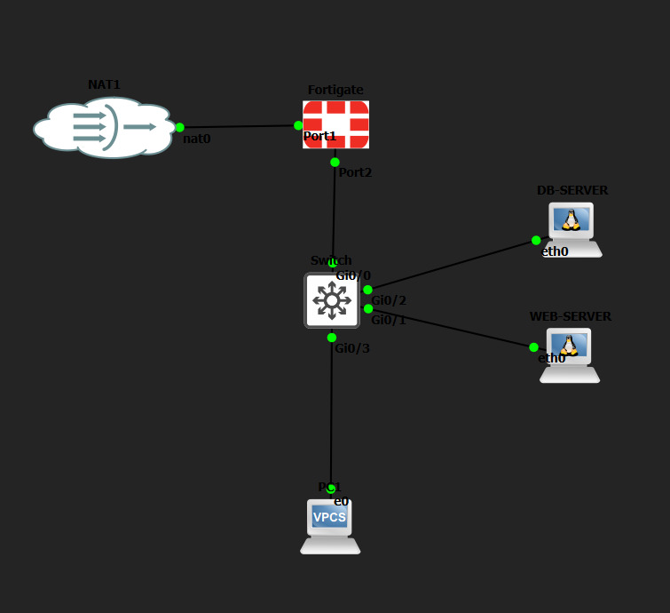
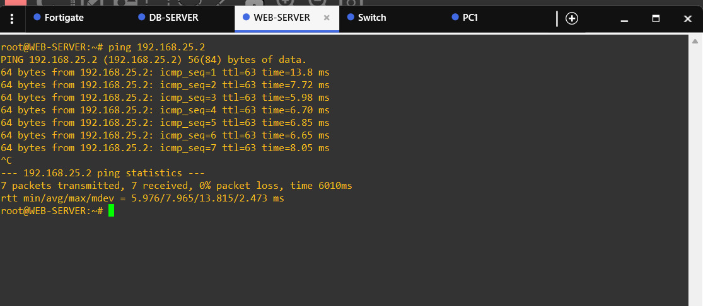
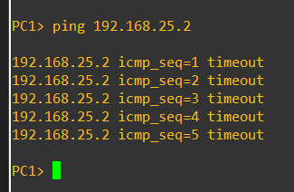

# Proyecto Final: Seguridad de Redes con FortiGate y Segmentación VLAN

**🎥 Video Demostrativo:** [ENLACE_DE_YOUTUBE_O_ONEDRIVE]

## Propósito del Laboratorio
El objetivo principal de esta práctica es demostrar cómo proteger una infraestructura de red aislando sus componentes críticos. Para lograrlo, dividí la topología en tres zonas distintas (VLANs) y utilicé un firewall FortiGate como núcleo central para inspeccionar y controlar el tráfico. La idea central del esquema de seguridad es proteger la base de datos: solo el servidor web tiene permiso para comunicarse con ella, mientras que los usuarios de la red general quedan totalmente bloqueados y sin acceso.

## Diagrama de nuestra Topología
Aquí se muestra cómo están conectados e integrados todos los equipos en GNS3:

## Resumen de la Infraestructura y Configuraciones

### 1. Firewall FortiGate (Nuestro núcleo de seguridad)
El FortiGate actúa como el guardia de seguridad de la red. Lo configuré para que funcione como la puerta de enlace (Gateway) de cada VLAN a través de su puerto 2, utilizando interfaces lógicas.
*   **Regla de Acceso Permitido:** Creé una política que permite que el tráfico fluya de manera segura desde la red de Servidores Web (VLAN 20) hacia la red de Base de Datos (VLAN 30).
*   **Regla de Bloqueo:** Para proteger la información sensible, implementé una política estricta que deniega de inmediato cualquier intento de conexión desde la red de Usuarios (VLAN 10) hacia la Base de Datos.

### 2. Switch Capa 2 (Segmentando la red)
Utilicé un switch Cisco para separar lógicamente los equipos, asignando cada puerto a una red específica para evitar que el tráfico se mezcle:
*   **VLAN 10 (Usuarios):** Conectada al puerto Gi0/3 (Subred `/25`).
*   **VLAN 20 (Servidores Web):** Conectada al puerto Gi0/1 (Subred `/28`).
*   **VLAN 30 (Base de Datos):** Conectada al puerto Gi0/2 (Subred `/28`).
*   **Puerto Troncal:** El puerto Gi0/0 se configuró en modo *trunk* (802.1q) para empaquetar y llevar todo el tráfico de estas tres VLANs directamente hacia el firewall.

### 3. Equipos Finales (Nodos)
A los servidores Linux les asigné direcciones IP estáticas para garantizar la estabilidad de los servicios y del enrutamiento:
*   **WEB-SERVER:** `192.168.33.2/28` (Gateway: `192.168.33.1`)
*   **DB-SERVER:** `192.168.25.2/28` (Gateway: `192.168.25.1`)
*   **PC1 (Usuario):** `192.168.8.2/25` (Gateway: `192.168.8.1`)

## Pruebas de Funcionamiento y Seguridad

A continuación, demuestro que las políticas del firewall están operando correctamente en la topología.

**✅ Prueba 1: Acceso Autorizado (Servidor Web -> Base de Datos)**
En esta primera captura, hacemos un ping desde nuestro Servidor Web hacia la Base de Datos. Como configuramos una política que permite este flujo de trabajo, el FortiGate deja pasar los paquetes de manera exitosa.

**❌ Prueba 2: Acceso Denegado (Usuario -> Base de Datos)**
En esta segunda prueba, simulamos a un usuario intentando hacer ping hacia la Base de Datos desde su PC. Tal como lo planeamos, la política de seguridad del firewall intercepta la solicitud y la bloquea por completo, resultando en un *timeout*.

## Archivos de Configuración de Respaldo
Adjunto los *running-configs* y los scripts utilizados para construir esta infraestructura por si se requiere replicar el laboratorio:
*   [Configuración del Switch Cisco](switch_config.txt)
*   [Configuración del Firewall FortiGate](fortigate_config.txt)
*   [Scripts de Red de los Servidores Linux](scripts_linux.sh)
